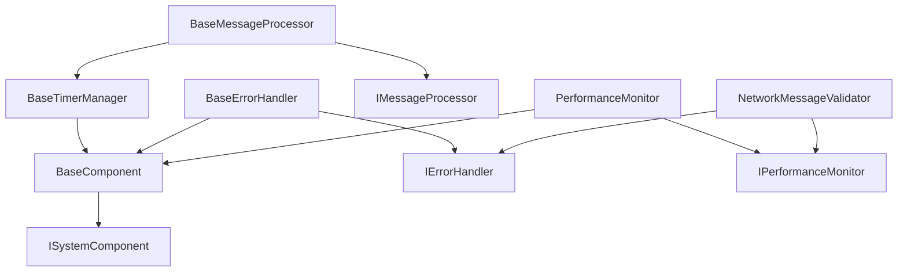

# YSBCaptain Project Documentation
> Mount & Blade II: Bannerlord Server-Side Mod for Enhanced Multiplayer
> For a general overview, installation instructions, and usage guidelines, please refer to the [README.md](./README.md) file.

## Project Structure Overview

YSBCaptain is organized into several key directories, each serving a specific purpose in the mod's architecture. The project follows a layered architecture with clear separation of concerns and dependency management.

## Core Systems

### Network Infrastructure
- **Server-Side Only**: 
  - Complete TaleWorlds network compatibility
  - No client modifications required
  - Native server appearance
  - Seamless matchmaking integration
  - Custom compression algorithms
  - Optimized packet handling

- **Capacity Management**: 
  - Supports 30+ players and 200+ bot formations
  - Dynamic bandwidth optimization
  - Enhanced performance scaling
  - Load balancing and throttling
  - Memory-efficient data structures

### Key Components

1. **Formation System**: 
   - Custom leashing (9999 units)
   - Dynamic AI behavior patterns
   - Extended formation capacity
   - Optimized pathfinding
   - Real-time formation updates
   - Collision avoidance system

2. **Spawning System**: 
   - Batch processing engine
   - Priority queue management
   - Network optimization
   - Formation integration
   - Memory pooling
   - Resource recycling

3. **Network Optimization**: 
   - Custom compression algorithms
   - Batched updates system
   - Priority-based synchronization
   - Bandwidth control
   - Delta compression
   - State prediction

4. **Logging System**: 
   - Centralized logging infrastructure
   - Multiple severity levels
   - Color-coded console output
   - Daily rotating log files
   - Network message logging
   - Performance logging
   - Structured logging format

5. **Health Monitoring**: 
   - Real-time system health checks
   - Performance metrics collection
   - Early warning system
   - Automated recovery procedures
   - Resource usage tracking
   - System diagnostics
   - Alert notifications

6. **Telemetry System**: 
   - Performance tracking
   - Metric collection
   - System diagnostics
   - Usage analytics
   - Error tracking
   - Performance profiling
   - Trend analysis

## Directory Structure

```
# YSBCaptain Project Structure

YSBCaptain/
├── Core/
│   ├── Base/
│   │   ├── BaseComponent.cs         # Base component implementation
│   │   └── BaseTimerManager.cs      # Timer management functionality
│   ├── Error/
│   │   └── BaseErrorHandler.cs      # Error handling and tracking
│   └── Interfaces/
│       ├── ISystemComponent.cs      # Core component interface
│       ├── IErrorHandler.cs         # Error handling interface
│       └── IPerformanceMonitor.cs   # Performance monitoring interface
│   ├── Configuration/             # Configuration management
│   │   ├── AppConfiguration.cs
│   │   └── ConfigurationProvider.cs
│   ├── HealthMonitoring/          # Health checks and telemetry
│   │   ├── HealthCheck.cs
│   │   └── Telemetry.cs
│   └── ResourceManagement/        # Resource management
│       └── ResourceManager.cs
├── Network/
│   ├── Base/
│   │   └── BaseMessageProcessor.cs  # Network message processing
│   ├── Extensions/
│   │   └── NetworkMessageExtensions.cs  # Network utility extensions
│   └── Validation/
│       └── NetworkMessageValidator.cs   # Message validation
│   ├── Optimization/              # Network optimization
│   │   ├── CustomCompression.cs
│   │   └── PacketHandling.cs
│   └── Protocol/                  # Network protocol handling
│       └── NetworkProtocol.cs
├── Performance/
│   └── PerformanceMonitor.cs       # Performance monitoring implementation
│   ├── MemoryProfiler.cs
│   └── PerformanceMonitor.cs
├── Tests/
│   ├── Core/
│   │   └── Compatibility/        # Compatibility tests
│   │       ├── FullCompatibilityTests.cs
│   │       └── TaleWorldsCompatibilityTests.cs
│   ├── Network/
│   └── Performance/
│   └── TestRunner.cs
├── docs/
│   ├── API.md
│   ├── DeploymentGuide.md
│   └── PerformanceGuide.md
├── bin/
│   └── Win64_Shipping_Server/
│       ├── YSBCaptain.dll
│       └── Dependencies/
│           ├── System.Threading.Channels.dll
│           ├── System.Memory.dll
│           └── [other dependencies]
├── ModuleData/
│   ├── config.json
│   └── advanced_config.json
├── Scripts/
│   ├── analyze_complexity.ps1
│   ├── check_compatibility.ps1
│   ├── check_threading.ps1
│   ├── find_health_references.ps1
│   ├── find_references.ps1
│   ├── find_telemetry_references.ps1
│   └── optimize_project.ps1
├── src/
│   ├── Core/
│   │   ├── Configuration/
│   │   ├── Events/
│   │   └── Logging/
│   ├── Gameplay/
│   │   ├── Systems/
│   │   └── Formations/
│   ├── Network/
│   │   ├── Optimization/
│   │   └── Protocol/
│   ├── Performance/
│   │   ├── Monitoring/
│   │   └── Optimization/
│   └── Utilities/
├── tests/
│   ├── Unit/
│   ├── Integration/
│   └── Performance/
├── README.md
├── CHANGELOG.md
├── LICENSE
└── YSBCaptain.csproj
```

## Directory Structure Explanation

### Root Level
- `bin/`: Compiled binaries and dependencies
- `docs/`: Comprehensive documentation
- `ModuleData/`: Configuration files
- `Scripts/`: Utility and maintenance scripts
- `src/`: Source code
- `tests/`: Test suites

### Documentation (`docs/`)
- `DeploymentGuide.md`: Installation and deployment instructions
- `PerformanceGuide.md`: Performance optimization guide
- `API.md`: API documentation and examples

### Source Code (`src/`)
- `Core/`: Core functionality and frameworks
- `Gameplay/`: Game mechanics and systems
- `Network/`: Networking and optimization
- `Performance/`: Performance monitoring and optimization
- `Utilities/`: Helper classes and utilities

### Configuration (`ModuleData/`)
- `config.json`: Main configuration file
- `advanced_config.json`: Advanced settings

### Scripts (`Scripts/`)
- PowerShell scripts for maintenance and optimization
- Analysis and reference finding tools

### Tests (`tests/`)
- Unit tests
- Integration tests
- Performance benchmarks

## Key Files

### Configuration Files
- `config.json`: Primary configuration
- `advanced_config.json`: Advanced settings
- `YSBCaptain.csproj`: Project configuration

### Documentation Files
- `README.md`: Project overview
- `CHANGELOG.md`: Version history
- `LICENSE`: License information

### Build Output
- `YSBCaptain.dll`: Main module assembly
- Dependencies: Required third-party libraries

## Module Organization

### Core Systems
- Configuration management
- Event system
- Logging framework

### Gameplay Systems
- Formation management
- Bot AI
- Combat mechanics

### Network Systems
- Optimization
- Protocol handling
- State synchronization

### Performance Systems
- Monitoring
- Optimization
- Resource management

## Development Guidelines

1. **Code Organization**
   - Follow namespace hierarchy
   - Keep related files together
   - Use appropriate subdirectories

2. **Documentation**
   - Update relevant docs
   - Keep README current
   - Document API changes

3. **Testing**
   - Add unit tests
   - Update integration tests
   - Run performance tests

4. **Deployment**
   - Follow deployment guide
   - Update dependencies
   - Check compatibility

## Technical Requirements

### Language and Runtime
- C# 7.3 for Bannerlord compatibility
- .NET Standard 2.0
- x64 platform target

### Dependencies
- Microsoft.Extensions.DependencyInjection (2.2.0)
- Microsoft.Extensions.Logging (2.2.0)
- Serilog (2.10.0)
- Serilog.Extensions.Logging (3.1.0)
- Serilog.Sinks.Console (4.1.0)
- Serilog.Sinks.File (5.0.0)

### Compatibility Notes
- No nullable reference types (C# 8.0+)
- No default interface methods (C# 8.0+)
- No pattern matching (C# 8.0+)
- No switch expressions (C# 8.0+)
- No range/index operators (C# 8.0+)
- No async streams (C# 8.0+)

### Code Style Guidelines
- Explicit null checks instead of null-conditional operators
- Method overloads instead of optional parameters
- Traditional foreach loops instead of LINQ where performance critical
- Explicit type declarations instead of var where clarity is needed
- Manual null checks instead of null-coalescing operators

## Implementation Details

### Threading Model
- **Concurrency Management**:
  - Thread-safe collections (`ConcurrentDictionary`, `ConcurrentQueue`)
  - Lock-free operations where possible
  - Proper synchronization using locks and async/await
  - Deadlock prevention mechanisms
  - Thread pool optimization

- **Resource Management**:
  - Memory pooling for efficient allocation
  - Object recycling
  - Batch processing
  - Async I/O operations
  - Resource cleanup

### Performance Optimization
- **Memory Efficiency**:
  - Pooled objects
  - Struct usage for value types
  - Minimal allocations
  - Efficient data structures

- **CPU Optimization**:
  - Batch processing
  - SIMD operations where applicable
  - Cached computations
  - Optimized algorithms

### Network Optimization
- **Bandwidth Management**:
  - Delta compression
  - Priority-based updates
  - Batched messages
  - State prediction

- **Latency Handling**:
  - Predictive movement
  - Input buffering
  - Lag compensation
  - State reconciliation

## Component Dependencies



## Key Components

### Core Layer
- **BaseComponent**: Foundation for all system components
  - State management
  - Resource cleanup
  - Logging integration

- **BaseTimerManager**: Timer-based operations
  - Interval management
  - Execution tracking
  - Error handling

- **BaseErrorHandler**: Error management
  - Rate limiting
  - Error tracking
  - Performance impact monitoring

### Network Layer
- **BaseMessageProcessor**: Message handling
  - Safe message processing
  - Batch operations
  - Performance monitoring

- **NetworkMessageValidator**: Message validation
  - Integer compression validation
  - Message integrity checks
  - Error reporting

- **NetworkMessageExtensions**: Utility extensions
  - Safe integer writing
  - Compression handling
  - Value adjustment

### Performance Layer
- **PerformanceMonitor**: System monitoring
  - Metric tracking
  - Performance analysis
  - Resource usage monitoring

## Design Patterns

### Component Pattern
- Clear separation of concerns
- Standardized interfaces
- Consistent behavior

### Observer Pattern
- Event-based communication
- Loose coupling
- Async operations

### Factory Pattern
- Component creation
- Resource management
- Dependency injection

## Testing Strategy

### Unit Tests
- Component isolation
- Interface contracts
- Error conditions

### Integration Tests
- Component interaction
- End-to-end scenarios
- Performance benchmarks

### Performance Tests
- Load testing
- Resource usage
- Bottleneck identification

## Build and Deployment

### Build Configuration
- Debug and Release builds
- Conditional compilation
- Code analysis
- Documentation generation
- Resource embedding

### Deployment Process
- Version management
- Package creation
- Distribution
- Installation verification
- Update management